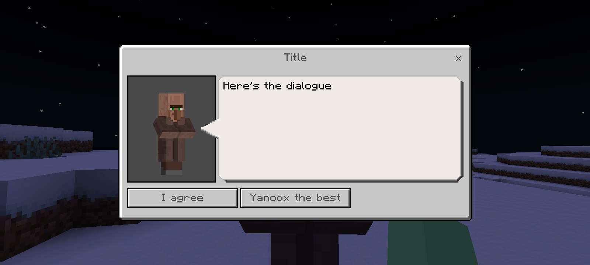

## DialogueUIAPI
<p align="center">
   <br>
</p>
# DialogueUIAPI is an API in PocketMine-MP 4.0.0 that allows you to easily create and manage a dialogue interface for NPCs.

## SETUP
**Only put the api in the src of your plugin and use it :)**

You will find an example in Example\Main.php

## Run this code when your plugin is activated. The function will register an essential listener
```php
DialogueHandler::register()
```

## Crate an instance of DialogueAPI
```php
$dialogue = DialogueAPI::create("DialogueTest", "Title", "Here's the dialogue",
    [
        DialogueButton::create("I agree")
            ->setHandler(function (Player $player, string $buttonName): void {
                $player->sendMessage("You've selected $buttonName.");
            }), 
        DialogueButton::create("Yanoox the best")
            ->setHandler(function (Player $player, string $buttonName): void {
                $player->sendMessage("Go starify his repository");
            })]);
```

## Send the interface to the players
Note that for this version of DialogueUIAPI, the entity is not necessary.

```php
$dialogue->displayTo([$player], $entity);
//or
$dialogue->displayTo([$player]);
```

## There you go! You can now create with certainty NPC interfaces for your server. Have a nice day ;)
*Browse the api to learn more*
